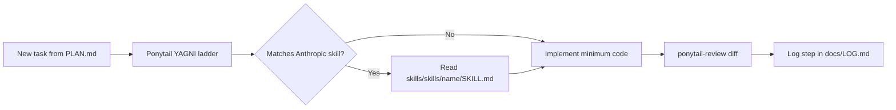

# CLOUDE — MACKHAN Skills & Agent Development Hub

> **ONLY blueprint:** [docs/PLAN.md](../docs/PLAN.md)  
> **Tasks (4 repos):** [docs/TASKS.md](../docs/TASKS.md) · **Memory:** [docs/LOG.md](../docs/LOG.md)  
> **Repo 1:** [Ponytail](https://github.com/DietrichGebert/ponytail) · **Repo 2:** [anthropics/skills](https://github.com/anthropics/skills) · **Repo 3:** [flutter/skills](https://github.com/flutter/skills) · **Repo 4:** [dart-lang/skills](https://github.com/dart-lang/skills)

---

## Overview

MACKHAN has **one mandatory boundary** — `docs/PLAN.md` — and **four agent repos** (all under `agent/`):

| Repo | Path | When |
|------|------|------|
| **1 Ponytail** | `agent/ponytail/` | Every task — minimum code |
| **2 Anthropic** | `agent/skills/` | Docs, UI design, backend/ML tests |
| **3 Flutter** | `agent/flutter-skills/` | Flutter tasks (§8) |
| **4 Dart** | `agent/dart-skills/` | Dart quality + tests (Tasks 12–17) |

**Task prompts:** [docs/TASKS.md](../docs/TASKS.md)

---

## Repository Layout

```
d:\MACKHAN\
├── AGENTS.md              ← thin pointer → agent/
├── .cursor/               ← stays at root (Cursor IDE)
│   ├── rules/
│   └── skills/            ← active skills Cursor loads
├── agent/                 ← ALL agent/skills tooling (this hub)
│   ├── README.md
│   ├── AGENTS.md
│   ├── CLOUDE.md          ← you are here
│   ├── cloude/CLAUDE.md
│   ├── ponytail/
│   ├── skills/            ← vendored anthropics/skills
│   ├── flutter-skills/
│   └── dart-skills/
├── docs/                  ← product blueprint + memory
├── mobile/ backend/ ml-service/ firebase/   ← product
└── agent/skills/ layout (Anthropic):
    ├── README.md
    ├── spec/
    ├── template/
    └── skills/
        ├── frontend-design/
        ├── doc-coauthoring/
        ├── webapp-testing/
        ├── mcp-builder/
        └── … (17 skills total)
```

---

## Ponytail — Always-On Code Minimizer

[Ponytail](https://github.com/DietrichGebert/ponytail) runs on **every coding task**. It forces agents to pick the simplest solution before writing new code.

| Command / skill | Path | When to use |
|-----------------|------|-------------|
| **Always on** | `.cursor/rules/ponytail.mdc` | Every code change — YAGNI ladder |
| ponytail | `.cursor/skills/ponytail/` | Explicit lazy mode (`lite` / `full` / `ultra`) |
| ponytail-review | `.cursor/skills/ponytail-review/` | Review current diff — what to delete |
| ponytail-audit | `.cursor/skills/ponytail-audit/` | Audit whole repo for over-engineering |
| ponytail-debt | `.cursor/skills/ponytail-debt/` | Track deferred shortcuts |
| ponytail-gain | `.cursor/skills/ponytail-gain/` | Show benchmark impact |
| ponytail-help | `.cursor/skills/ponytail-help/` | Command reference |

**How it chunks code:** before writing, the agent checks YAGNI → reuse → stdlib → native → existing dep → one line → minimum. Security, validation, and error handling are never removed.

---

## Allowed Flutter Skills (Repo 3 — PLAN §0.3)

From [flutter/skills](https://github.com/flutter/skills) at `flutter-skills/`:

| Skill | PLAN section |
|-------|--------------|
| flutter-setup-declarative-routing | §8.3 go_router |
| flutter-apply-architecture-best-practices | §8 Riverpod layers |
| flutter-implement-json-serialization | §8 models |
| flutter-use-http-package | §8 API (use **Dio** per plan, not http) |
| flutter-add-widget-test | §8.8 |
| flutter-add-integration-test | §8.8 |
| flutter-fix-layout-issues | §8.4 UI fixes |
| flutter-build-responsive-layout | §8.4.9 resolution prefs |

## Allowed Dart Skills (Repo 4 — PLAN §0.3)

From [dart-lang/skills](https://github.com/dart-lang/skills) at `dart-skills/`:

| Skill | PLAN section |
|-------|--------------|
| dart-run-static-analysis | §8 — dart analyze + fix |
| dart-use-primary-constructors | §8 models |
| dart-use-pattern-matching | §8 validators, state |
| dart-add-unit-test | §8.8 |
| dart-generate-test-mocks | §8.8 |
| dart-collect-coverage | §8.8 |
| dart-fix-runtime-errors | §8 debug |
| dart-resolve-package-conflicts | §8.1 pubspec |

## Allowed Anthropic Skills (Repo 2 — PLAN §0.3)

> Other skills in `skills/` are **forbidden** until PLAN.md is updated.

| Skill | Use for |
|-------|---------|
| [doc-coauthoring](skills/skills/doc-coauthoring/) | README, API.md, INSTALLATION.md, DEPLOYMENT.md |
| [frontend-design](skills/skills/frontend-design/) | Flutter UI screens (§8.4) |
| [theme-factory](skills/skills/theme-factory/) | Material 3 light/dark theme |
| [webapp-testing](skills/skills/webapp-testing/) | Backend, ML, Flutter tests |
| [skill-creator](skills/skills/skill-creator/) | Copy allowed skills to `.cursor/skills/` |

---

## Top Tools for MVP Build

Based on [docs/PLAN.md](docs/PLAN.md) implementation order:

0. **ponytail** (always on) — minimum code on every change
1. **frontend-design** — Flutter auth, home, camera, profile, settings UI
2. **doc-coauthoring** — Structured writing for all `docs/` deliverables
3. **theme-factory** — Light/dark Material 3 theme definition
4. **webapp-testing** — Testing patterns for services and future web tools
5. **ponytail-review** — After each feature, trim over-engineered diffs
6. **skill-creator** — Create reusable MACKHAN skills as patterns emerge

---

## Workflow



---

## Updating the Skills Copy

The local `skills/` folder was fetched from GitHub main branch. To refresh:

```powershell
# Re-download all SKILL.md files (no git required)
$skills = @('algorithmic-art','brand-guidelines','canvas-design','claude-api','doc-coauthoring','docx','frontend-design','internal-comms','mcp-builder','pdf','pptx','skill-creator','slack-gif-creator','theme-factory','web-artifacts-builder','webapp-testing','xlsx')
foreach ($s in $skills) {
  curl.exe -sL "https://raw.githubusercontent.com/anthropics/skills/main/skills/$s/SKILL.md" -o "skills/skills/$s/SKILL.md"
}
```

For a full clone (requires git):

```bash
git clone https://github.com/anthropics/skills.git skills
```

---

## Updating Ponytail

```powershell
curl.exe -L "https://github.com/DietrichGebert/ponytail/archive/refs/heads/main.zip" -o ponytail-main.zip
Expand-Archive ponytail-main.zip -DestinationPath . -Force
Remove-Item ponytail -Recurse -Force; Rename-Item ponytail-main ponytail
Copy-Item ponytail\.cursor\rules\ponytail.mdc .cursor\rules\ponytail.mdc -Force
# Re-copy skills
Get-ChildItem ponytail\skills -Directory | ForEach-Object { Copy-Item $_.FullName .cursor\skills\$($_.Name) -Recurse -Force }
```

---

## Links

- [Ponytail on GitHub](https://github.com/DietrichGebert/ponytail)
- [Anthropic Skills on GitHub](https://github.com/anthropics/skills)
- [Agent Skills specification (agentskills.io)](http://agentskills.io)
- [What are skills? (Claude Help)](https://support.claude.com/en/articles/12512176-what-are-skills)
- [Creating custom skills](https://support.claude.com/en/articles/12512198-creating-custom-skills)
