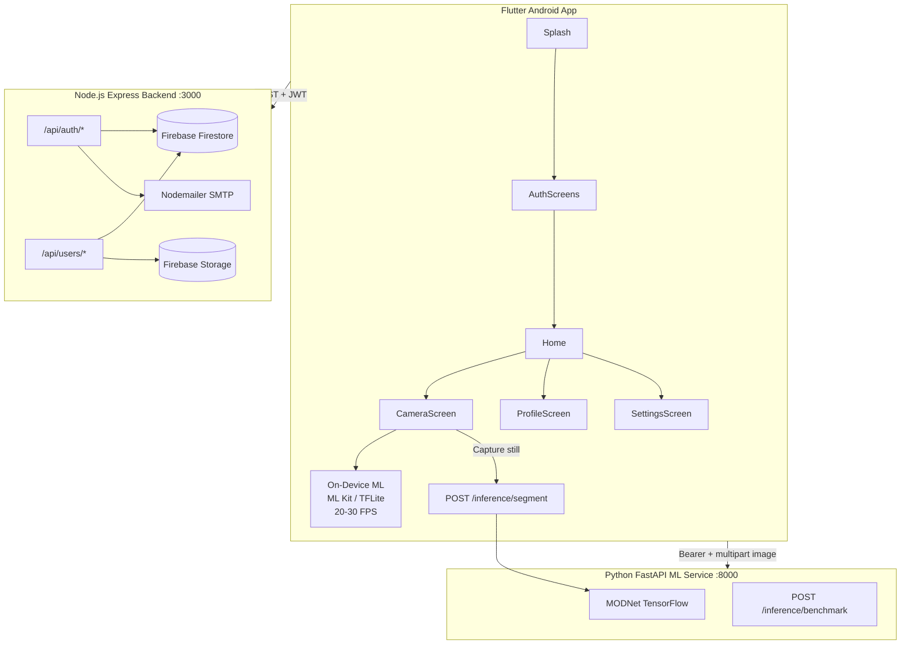
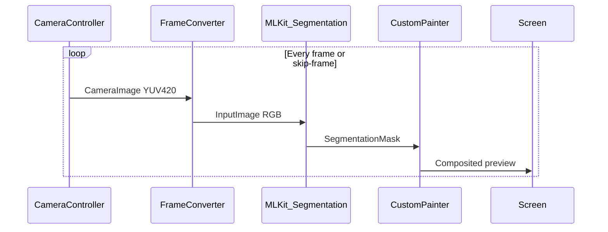
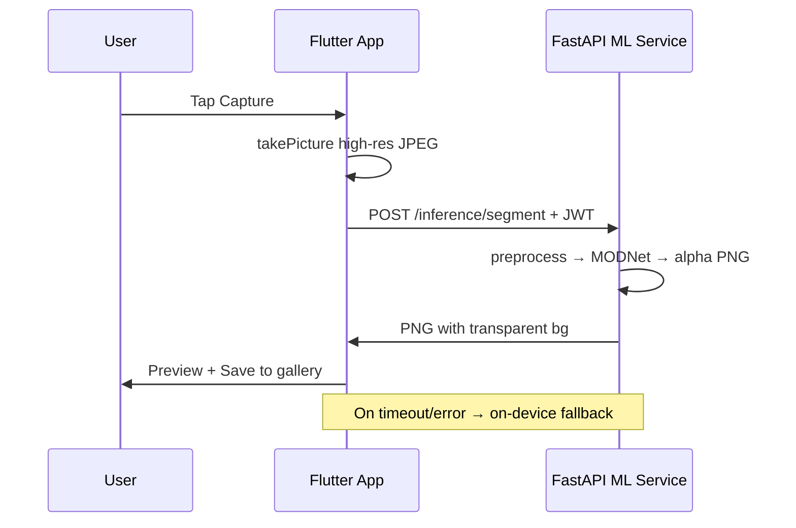

# Real-Time Background Removal — Complete Implementation Plan

> **This file is the ONLY blueprint for MACKHAN.**  
> **Primary product:** Flutter **Android mobile app** (`mobile/`) — real-time background removal.  
> **Supporting:** Express API (`backend/`) + FastAPI ML (`ml-service/`) + Firebase — called by the app over HTTP.  
> **Stack:** Flutter Android · Node.js/Express · Firebase Firestore · Python FastAPI · Hybrid ML inference

---

## 0. Plan Authority — MANDATORY (Read First)

### 0.1 Rule: Never go outside this plan

| Rule | Detail |
|------|--------|
| **Single source of truth** | `docs/PLAN.md` defines WHAT to build — stack, files, APIs, screens, tests, docs |
| **Out of scope** | Only items listed in **§14 Post-MVP** are forbidden until plan is updated |
| **No extra features** | Do not add iOS, social login, video recording, blur, push, Claude API, admin dashboards, MCP servers, or any library/stack not listed here |
| **No extra files** | Do not create files or folders not listed in **§3 Monorepo Structure** (except `docs/LOG.md` entries and checked-off deliverables) |
| **Skills/repos are HOW, not WHAT** | Ponytail + Anthropic + Flutter + Dart Skills help write code — they do not change the plan |
| **Primary product** | Flutter **Android app** in `mobile/` — not web, not iOS, not desktop |
| **Why backend exists** | `backend/server.js` is the REST API the Android app calls (auth, profile). Not a website. |

**If a task is not in this plan → do not build it. Ask to update PLAN.md first.**

### 0.2 What each project file is for

| File / folder | Purpose | Mandatory? |
|---------------|---------|------------|
| **`docs/PLAN.md`** | Blueprint — stack, structure, APIs, screens, security, tests | **Read every task** |
| **`docs/TASKS.md`** | Phase 1 step prompts — one task at a time | Use for copy-paste prompts |
| **`docs/PLAN2.md`** | Phase 2 blueprint — custom training after MVP | After TASKS.md complete |
| **`docs/TASKS2.md`** | Phase 2 step prompts (Tasks 21–31) | After TASKS.md complete |
| **`docs/PIXEL_LIFT_PLAN.md`** | Product polish — Pixel Lift branding, modes, accuracy | After MVP runs on device; promote slices into PLAN.md before coding |
| **`docs/LOG.md`** | Project memory + history — what is done, what is next | **Read + update every task** |
| **`docs/API.md`** | API reference (deliverable §11.1) | Build in todo #16 |
| **`docs/INSTALLATION.md`** | Setup guide (deliverable §11.2) | Build in todo #16 |
| **`docs/DEPLOYMENT.md`** | Deploy guide (deliverable §11.3) | Build in todo #16 |
| **`agent/`** | All agent/skills tooling (not product code) | Reference only |
| **`agent/CLOUDE.md`** | Index — points back to this plan | Reference only |
| **`agent/cloude/CLAUDE.md`** | Agent workflow — enforces this plan | Reference only |
| **`AGENTS.md`** / **`agent/AGENTS.md`** | Root pointer + full agent rules | Reference only |
| **`agent/ponytail/`** | Repo 1 — minimum code (YAGNI) on **every task** | Read `SKILL.md` before every task |
| **`agent/skills/`** | Repo 2 — Anthropic task helpers (see §0.3) | Read `SKILL.md` when task matches |
| **`agent/flutter-skills/`** | Repo 3 — Flutter team skills ([flutter/skills](https://github.com/flutter/skills)) | Flutter tasks §8 (Tasks 12–17) |
| **`agent/dart-skills/`** | Repo 4 — Dart team skills ([dart-lang/skills](https://github.com/dart-lang/skills)) | Dart/Flutter tasks §8 (Tasks 12–17) |
| **`.cursor/rules/`** | Cursor always-on rules (ponytail + mackhan) — stays at root | Auto-loaded |
| **`.cursor/skills/`** | Active skills Cursor loads — stays at root | Auto-loaded |
| **`backend/`** | Express API (§6) | Product code |
| **`ml-service/`** | FastAPI MODNet inference (§7) | Product code |
| **`mobile/`** | Flutter Android app (§8) | Product code |
| **`firebase/`** | Firestore + Storage rules (§5) | Product config |

### 0.3 Allowed agent repos and skills (only these)

Four repos are **mandatory for how we code**. Only skills listed here may be used.

#### Repo 1 — Ponytail ([DietrichGebert/ponytail](https://github.com/DietrichGebert/ponytail))

| Skill | Use for |
|-------|---------|
| `ponytail` | **Every task** — minimum code (setup, docs, code, tests — no exceptions) |
| `ponytail-review` | After each feature phase — trim diff (Tasks 8b, 11b, 16b) |
| `ponytail-audit` | Final audit before project complete (Task 20b) |

#### Repo 2 — Anthropic ([anthropics/skills](https://github.com/anthropics/skills)) — path: `agent/skills/`

| Skill | Use for (PLAN section) |
|-------|------------------------|
| `doc-coauthoring` | Docs: README, API.md, INSTALLATION.md, DEPLOYMENT.md, Firebase guide (§11) |
| `frontend-design` | Flutter UI look-and-feel (§8.4) |
| `theme-factory` | Material 3 light/dark theme (§8 theme, §8.4.9) |
| `webapp-testing` | Backend Jest, ML pytest (§6.7, §7.7) |
| `skill-creator` | Copy skills to `.cursor/skills/` (setup) |

#### Repo 3 — Flutter ([flutter/skills](https://github.com/flutter/skills)) — path: `agent/flutter-skills/`

| Skill | Use for (PLAN section) |
|-------|------------------------|
| `flutter-setup-declarative-routing` | go_router setup (§8.3) |
| `flutter-apply-architecture-best-practices` | Riverpod layers: UI, providers, repositories (§8) |
| `flutter-implement-json-serialization` | User, auth_response models (§8 models) |
| `flutter-use-http-package` | API client patterns — **use Dio per §8.1, not http package** |
| `flutter-add-widget-test` | Widget tests (§8.8) |
| `flutter-add-integration-test` | Integration tests (§8.8) |
| `flutter-fix-layout-issues` | Fix overflow/layout errors during §8.4 screens |
| `flutter-build-responsive-layout` | Resolution prefs 480p/720p/1080p (§8.4.9) |

**Repo 3 + Repo 4 apply to Flutter/Dart tasks only (TASKS.md Tasks 12–17).** Backend/ML/doc tasks add Repo 2 only — **Repo 1 Ponytail is always mandatory on every task.**

#### Repo 4 — Dart ([dart-lang/skills](https://github.com/dart-lang/skills)) — path: `agent/dart-skills/`

| Skill | Use for (PLAN section) |
|-------|------------------------|
| `dart-run-static-analysis` | `dart analyze` + `dart fix` on all Dart code (§8) |
| `dart-use-primary-constructors` | Model classes: user, auth_response (§8 models) |
| `dart-use-pattern-matching` | Validators, auth state handling (§8) |
| `dart-add-unit-test` | Unit tests for validators, repositories (§8.8) |
| `dart-generate-test-mocks` | Mock API client, auth repo in tests (§8.8) |
| `dart-collect-coverage` | Test coverage reports (§8.8) |
| `dart-fix-runtime-errors` | Debug/fix Dart runtime errors during §8 |
| `dart-resolve-package-conflicts` | Fix `pub get` / pubspec conflicts (§8.1) |

**Not allowed:** Any skill not in the tables above, including claude-api, mcp-builder, pdf, docx, dart-build-cli-app, dart-setup-ffi-assets, dart-use-ffigen, dart-migrate-to-checks-package, flutter-setup-localization, flutter-add-widget-preview, and all other unlisted skills.

### 0.4 Mandatory workflow (every task)

```
1. READ  docs/PLAN.md       → find section + todo; stay inside plan only
2. READ  docs/TASKS.md      → pick next unchecked task
3. READ  docs/LOG.md        → check history; do not repeat done work
4. READ  Ponytail SKILL.md  → .cursor/skills/ponytail/SKILL.md (Repo 1 — always)
5. READ  Anthropic SKILL.md → skills/skills/{name}/SKILL.md (Repo 2 — if task matches §0.3)
6. READ  Flutter SKILL.md   → flutter-skills/skills/{name}/SKILL.md (Repo 3 — Tasks 12–17)
7. READ  Dart SKILL.md      → dart-skills/skills/{name}/SKILL.md (Repo 4 — Tasks 12–17)
8. BUILD  exactly what PLAN.md specifies — nothing extra
9. APPLY  Ponytail YAGNI — can this diff be shorter? (mandatory before done)
10. UPDATE docs/LOG.md       → append step, set next
11. CHECK docs/TASKS.md     → mark task complete
```

### 0.5 TASKS.md → PLAN.md mapping

| TASKS.md task | PLAN.md todo | PLAN section |
|---------------|--------------|--------------|
| Task 0 | Setup | §0.3 (copy Anthropic skills) |
| Task 0a | Setup | §0.3 (clone + copy Flutter skills) |
| Task 0b | Setup | §0.3 (clone + copy Dart skills) |
| Task 1 | #1 | §3, §4.4 |
| Task 2 | #2 | §5 |
| Task 3 | #3 | §6.1–§6.3 |
| Task 4 | #4 | §5.2, §6 |
| Task 5 | #5 | §6.2 auth |
| Task 6 | #6 | §6.2 users |
| Task 7 | #7 | §6.3–§6.5 |
| Task 8 | #7 | §6.7 |
| Task 9 | #8 | §7.1–§7.2 |
| Task 10 | #9 | §7.3–§7.6 |
| Task 11 | #10 | §7.6–§7.7 |
| Task 12 | #11 | §8.1–§8.3 |
| Task 13 | #12 | §8.4.1–§8.4.5, §8.7 |
| Task 14 | #13 | §8.4.6, §8.4.8–§8.4.9 |
| Task 15 | #14 | §8.4.7, §8.5 |
| Task 16 | #15 | §8.6 |
| Task 17 | #16 | §8.8 |
| Task 18–19 | #16 | §11.1–§11.3 |
| Task 20 | #16 | §10, §11, root README |

### 0.6 Agent setup (completed prerequisite)

- [x] Ponytail v4.8.4 vendored at `ponytail/`
- [x] Anthropic Skills vendored at `skills/`
- [x] Flutter Skills vendored at `flutter-skills/`
- [x] Dart Skills vendored at `dart-skills/` ([dart-lang/skills](https://github.com/dart-lang/skills))
- [x] Cursor rules: `.cursor/rules/ponytail.mdc`, `.cursor/rules/mackhan.mdc`
- [x] Cursor skills: Repo 1 (×6) + Repo 2 (×4) + Repo 3 (×8) + Repo 4 (×8 Dart skills per §0.3)
- [x] Docs: `docs/TASKS.md`, `docs/LOG.md`, `CLOUDE.md`, `cloude/CLAUDE.md`, `AGENTS.md`

---

## Implementation Todos

- [x] Create monorepo root: README, .gitignore, docker-compose.yml, docs/, root .env.example
- [x] Document Firebase project setup: Firestore collections, indexes, security rules, Storage bucket, service account
- [x] Scaffold backend/: Express server, firebase-admin config, env validation, Winston logger, error handler
- [x] Implement Firestore repositories: users, verificationCodes, sessions + Firebase Storage service
- [x] Implement auth controllers/routes: register, verify, login, forgot/reset password, refresh, logout
- [x] Implement user controllers/routes: GET/PUT profile, change password, profile image upload
- [x] Add Joi validators, rate limiters, Helmet/CORS, Jest + Supertest auth tests with mocked Firestore
- [x] Scaffold ml-service/: FastAPI app, requirements.txt, Dockerfile, model download script
- [x] Implement preprocessing, MODNet inference, postprocessing (mask + alpha composite), /health and /segment endpoints
- [x] Add /inference/benchmark endpoint, inference validation script, FPS/latency logging
- [x] Create Flutter project: Riverpod, go_router, Material 3 theme, core services (ApiClient, secure storage)
- [x] Build auth feature: Splash, Login, Register, Verify, Forgot/Reset Password screens + auth repository
- [x] Build Home, Profile, Settings screens with user data, dark mode, resolution/quality prefs
- [x] Build Camera screen: live preview, ML Kit segmentation, CustomPainter compositing, all controls
- [x] Implement HQ capture: upload to ML service, result preview, gallery save, on-device fallback
- [x] Write Flutter widget/integration tests, API.md, INSTALLATION.md, DEPLOYMENT.md, root README

---

## 1. Project Summary

**App name:** Real-Time Background Removal  
**Platform:** Android (Flutter)  
**Goal:** Authenticate users, verify email via OTP, stream camera frames, remove background in real time (on-device), capture high-quality segmented images (server-side), and manage user profiles securely.

### Locked-in decisions

| Area | Choice |
|------|--------|
| State management | Riverpod |
| Database | Firebase Firestore (+ Firebase Storage for images) |
| Live inference | On-device — Google ML Kit Selfie Segmentation + TFLite fallback |
| Capture inference | Server-side — MODNet via Python FastAPI |
| Auth | Custom Express JWT (access 15m + refresh 7d), bcrypt passwords, Nodemailer OTP |
| UI | Material Design 3, light/dark mode |

---

## 2. System Architecture



### Data flow — live camera



### Data flow — HQ capture



---

## 3. Monorepo Structure

```
d:\MACKHAN\
├── AGENTS.md                   # agent rules — enforces this plan
├── CLOUDE.md                   # skills index — points to this plan
├── cloude/
│   └── CLAUDE.md               # full agent guide — enforces this plan
├── .cursor/
│   ├── rules/
│   │   ├── ponytail.mdc        # Repo 1: minimum code (always on)
│   │   └── mackhan.mdc         # project context (always on)
│   └── skills/                 # all 3 repos — Ponytail + Anthropic + Flutter (§0.3)
├── ponytail/                   # Repo 1 — vendored Ponytail (dev tooling)
├── skills/                     # Repo 2 — vendored Anthropic skills (dev tooling)
├── flutter-skills/             # Repo 3 — vendored flutter/skills (dev tooling)
├── dart-skills/                # Repo 4 — vendored dart-lang/skills (dev tooling)
├── README.md
├── .gitignore
├── docker-compose.yml
├── .env.example
├── firebase/
│   ├── firestore.rules
│   ├── firestore.indexes.json
│   └── storage.rules
├── docs/
│   ├── PLAN.md                 # this file — ONLY blueprint
│   ├── TASKS.md                # step prompts from this plan
│   ├── LOG.md                  # project memory + history
│   ├── API.md
│   ├── INSTALLATION.md
│   └── DEPLOYMENT.md
├── backend/
│   ├── server.js
│   ├── package.json
│   ├── .env.example
│   ├── jest.config.js
│   └── src/
│       ├── config/
│       │   ├── env.js
│       │   └── firebase.js
│       ├── repositories/
│       │   ├── userRepository.js
│       │   ├── otpRepository.js
│       │   └── sessionRepository.js
│       ├── controllers/
│       │   ├── authController.js
│       │   └── userController.js
│       ├── routes/
│       │   ├── authRoutes.js
│       │   ├── userRoutes.js
│       │   └── index.js
│       ├── middleware/
│       │   ├── auth.js
│       │   ├── validate.js
│       │   ├── rateLimiter.js
│       │   └── errorHandler.js
│       ├── services/
│       │   ├── emailService.js
│       │   ├── tokenService.js
│       │   ├── otpService.js
│       │   └── storageService.js
│       ├── validators/
│       │   ├── authValidators.js
│       │   └── userValidators.js
│       └── utils/
│           ├── ApiError.js
│           ├── asyncHandler.js
│           └── logger.js
├── ml-service/
│   ├── main.py
│   ├── requirements.txt
│   ├── Dockerfile
│   ├── .env.example
│   ├── scripts/
│   │   └── download_model.py
│   ├── models/
│   │   └── .gitkeep
│   ├── inference/
│   │   ├── engine.py
│   │   └── segment.py
│   ├── preprocessing/
│   │   └── frame.py
│   ├── postprocessing/
│   │   └── mask.py
│   ├── api/
│   │   ├── routes.py
│   │   ├── schemas.py
│   │   └── auth.py
│   └── tests/
│       └── test_inference.py
└── mobile/
    ├── pubspec.yaml
    ├── android/
    │   └── app/src/main/AndroidManifest.xml
    ├── assets/
    │   └── models/
    │       └── selfie_segmentation.tflite   # fallback model
    └── lib/
        ├── main.dart
        ├── app.dart
        ├── router.dart
        ├── core/
        │   ├── constants/
        │   │   ├── api_constants.dart
        │   │   └── app_constants.dart
        │   ├── theme/
        │   │   └── app_theme.dart
        │   ├── utils/
        │   │   ├── validators.dart
        │   │   └── image_utils.dart
        │   └── services/
        │       ├── api_client.dart
        │       ├── secure_storage_service.dart
        │       ├── ml_on_device_service.dart
        │       └── settings_service.dart
        ├── models/
        │   ├── user.dart
        │   ├── auth_response.dart
        │   └── api_error.dart
        ├── repositories/
        │   ├── auth_repository.dart
        │   ├── user_repository.dart
        │   └── ml_repository.dart
        ├── providers/
        │   ├── auth_provider.dart
        │   ├── theme_provider.dart
        │   ├── camera_provider.dart
        │   └── settings_provider.dart
        ├── features/
        │   ├── auth/
        │   │   ├── presentation/
        │   │   │   ├── splash_screen.dart
        │   │   │   ├── login_screen.dart
        │   │   │   ├── register_screen.dart
        │   │   │   ├── verify_email_screen.dart
        │   │   │   ├── forgot_password_screen.dart
        │   │   │   └── reset_password_screen.dart
        │   │   └── widgets/
        │   │       └── auth_form_field.dart
        │   ├── home/
        │   │   └── presentation/home_screen.dart
        │   ├── camera/
        │   │   ├── presentation/camera_screen.dart
        │   │   ├── widgets/segmentation_painter.dart
        │   │   └── services/camera_service.dart
        │   ├── profile/
        │   │   └── presentation/profile_screen.dart
        │   └── settings/
        │       └── presentation/settings_screen.dart
        └── widgets/
            ├── app_button.dart
            ├── loading_overlay.dart
            └── error_snackbar.dart
```

---

## 4. Environment Configuration

### 4.1 Backend `.env.example`

```env
PORT=3000
NODE_ENV=development
CLIENT_URL=http://localhost

# Firebase Admin SDK (use ONE of these approaches)
FIREBASE_PROJECT_ID=
FIREBASE_CLIENT_EMAIL=
FIREBASE_PRIVATE_KEY=          # escape newlines as \n
FIREBASE_STORAGE_BUCKET=
# OR
GOOGLE_APPLICATION_CREDENTIALS=./serviceAccountKey.json

# JWT
JWT_SECRET=                      # min 32 chars random
JWT_REFRESH_SECRET=              # min 32 chars random
JWT_ACCESS_EXPIRES=15m
JWT_REFRESH_EXPIRES=7d

# Email (Nodemailer)
SMTP_HOST=smtp.gmail.com
SMTP_PORT=587
SMTP_USER=
SMTP_PASS=
EMAIL_FROM="Real-Time BG Removal <noreply@yourdomain.com>"

# ML Service (for server-side health checks if needed)
ML_SERVICE_URL=http://localhost:8000
```

### 4.2 ML Service `.env.example`

```env
PORT=8000
MODEL_TYPE=modnet                 # modnet | deeplab
MODEL_PATH=./models/modnet.pb
JWT_SECRET=                       # same as backend JWT_SECRET for token validation
MAX_IMAGE_SIZE_MB=10
INFERENCE_TIMEOUT_SEC=30
LOG_LEVEL=INFO
```

### 4.3 Mobile config (`mobile/assets/.env` + `--dart-define`)

```env
API_BASE_URL=http://10.0.2.2:3000    # Android emulator → host machine
ML_SERVICE_URL=http://10.0.2.2:8000
```

Production builds use `--dart-define=API_BASE_URL=https://api.yourdomain.com`.

### 4.4 Docker Compose

```yaml
services:
  backend:
    build: ./backend
    ports: ["3000:3000"]
    env_file: ./backend/.env
    volumes: ["./backend:/app", "/app/node_modules"]
    depends_on: [ml-service]

  ml-service:
    build: ./ml-service
    ports: ["8000:8000"]
    env_file: ./ml-service/.env
    volumes: ["./ml-service/models:/app/models"]
```

No database container — Firebase is cloud-hosted. Optional Firebase Emulator documented in INSTALLATION.md.

---

## 5. Firebase Setup

### 5.1 Console steps

1. Create project at [Firebase Console](https://console.firebase.google.com).
2. Enable **Firestore Database** (production mode).
3. Enable **Storage** (default bucket).
4. Project Settings → Service Accounts → Generate new private key → save as `backend/serviceAccountKey.json` (gitignored).
5. Create composite indexes (see below).

### 5.2 Firestore collections

**`users`** (doc ID = UUID v4)

| Field | Type | Notes |
|-------|------|-------|
| fullName | string | required |
| email | string | lowercase, unique |
| password | string | bcrypt hash, never returned in API |
| isVerified | boolean | default false |
| profileImageUrl | string | nullable, Firebase Storage URL |
| createdAt | timestamp | server timestamp |
| updatedAt | timestamp | server timestamp |

**`verificationCodes`** (doc ID = auto)

| Field | Type | Notes |
|-------|------|-------|
| email | string | indexed |
| code | string | 6-digit OTP |
| type | string | `register` \| `reset` |
| expiresAt | timestamp | 10 min from creation |
| createdAt | timestamp | |

**`sessions`** (doc ID = auto)

| Field | Type | Notes |
|-------|------|-------|
| userId | string | indexed |
| refreshTokenHash | string | SHA-256 of refresh token |
| deviceInfo | string | optional user-agent |
| expiresAt | timestamp | 7 days |
| createdAt | timestamp | |

### 5.3 Required Firestore indexes

```json
{
  "indexes": [
    {
      "collectionGroup": "users",
      "fields": [{ "fieldPath": "email", "order": "ASCENDING" }]
    },
    {
      "collectionGroup": "verificationCodes",
      "fields": [
        { "fieldPath": "email", "order": "ASCENDING" },
        { "fieldPath": "type", "order": "ASCENDING" },
        { "fieldPath": "createdAt", "order": "DESCENDING" }
      ]
    },
    {
      "collectionGroup": "sessions",
      "fields": [
        { "fieldPath": "userId", "order": "ASCENDING" },
        { "fieldPath": "expiresAt", "order": "DESCENDING" }
      ]
    }
  ]
}
```

### 5.4 Security rules

**Firestore** (`firebase/firestore.rules`):
```
rules_version = '2';
service cloud.firestore {
  match /databases/{database}/documents {
    match /{document=**} {
      allow read, write: if false;  // All access via Admin SDK only
    }
  }
}
```

**Storage** (`firebase/storage.rules`):
```
rules_version = '2';
service firebase.storage {
  match /b/{bucket}/o {
    match /profile-images/{userId}/{fileName} {
      allow read: if true;           // public profile avatars
      allow write: if false;         // uploads via backend Admin SDK only
    }
  }
}
```

---

## 6. Backend — Complete Specification

### 6.1 Dependencies (`package.json`)

```
express, firebase-admin, bcrypt, jsonwebtoken, nodemailer,
helmet, cors, express-rate-limit, multer, joi, winston,
uuid, dotenv, crypto (built-in)
dev: jest, supertest, nodemon
```

### 6.2 API Reference

#### POST `/api/auth/register`

**Request:**
```json
{ "fullName": "Jane Doe", "email": "jane@example.com", "password": "securePass1" }
```

**Validation:** fullName min 2 chars; email valid; password min 8 chars, 1 uppercase, 1 number.

**Logic:**
1. Check email not already in Firestore.
2. Hash password (bcrypt cost 12).
3. Create user doc with `isVerified: false`.
4. Generate 6-digit OTP, store in `verificationCodes` (type: `register`, expires 10 min).
5. Send OTP email via Nodemailer.
6. Return `201 { message, email }` — no tokens until verified.

**Errors:** `409` email exists, `400` validation, `500` email send failure.

---

#### POST `/api/auth/verify`

**Request:**
```json
{ "email": "jane@example.com", "code": "123456" }
```

**Logic:**
1. Find latest valid OTP for email + type `register`.
2. Compare code; check not expired.
3. Set `users.isVerified = true`.
4. Delete used OTP doc.
5. Return `200 { message: "Email verified" }`.

---

#### POST `/api/auth/login`

**Request:**
```json
{ "email": "jane@example.com", "password": "securePass1" }
```

**Logic:**
1. Find user by email; `401` if not found.
2. Compare bcrypt password; `401` if mismatch.
3. Reject if `!isVerified` → `403 { code: "EMAIL_NOT_VERIFIED" }`.
4. Generate access JWT (payload: `{ userId, email }`) + refresh JWT.
5. Hash refresh token, store session in Firestore.
6. Return:
```json
{
  "accessToken": "...",
  "refreshToken": "...",
  "user": { "id", "fullName", "email", "isVerified", "profileImageUrl" }
}
```

---

#### POST `/api/auth/forgot-password`

**Request:** `{ "email": "jane@example.com" }`

**Logic:** If user exists, create OTP (type: `reset`), send email. Always return `200` (prevent email enumeration).

---

#### POST `/api/auth/reset-password`

**Request:**
```json
{ "email": "jane@example.com", "code": "123456", "newPassword": "newSecure1" }
```

**Logic:** Validate OTP (type: `reset`), update password hash, delete OTP, invalidate all sessions for user.

---

#### POST `/api/auth/refresh`

**Request:** `{ "refreshToken": "..." }`

**Logic:**
1. Verify refresh JWT signature.
2. Find session by userId + token hash; reject if expired/revoked.
3. Rotate: delete old session, create new session with new refresh token.
4. Return new `{ accessToken, refreshToken }`.

---

#### POST `/api/auth/logout`

**Headers:** `Authorization: Bearer <accessToken>`  
**Request:** `{ "refreshToken": "..." }`

**Logic:** Delete matching session doc. Return `200`.

---

#### GET `/api/users/me`

**Headers:** `Authorization: Bearer <accessToken>`

**Response:**
```json
{
  "id": "uuid",
  "fullName": "Jane Doe",
  "email": "jane@example.com",
  "isVerified": true,
  "profileImageUrl": "https://...",
  "createdAt": "2026-01-01T00:00:00Z"
}
```

---

#### PUT `/api/users/me`

**Headers:** `Authorization: Bearer <accessToken>`  
**Body:** `multipart/form-data` — fields: `fullName` (optional), `profileImage` (optional file, max 5MB, jpeg/png)

**Logic:** Update Firestore fields; if image provided, upload to `profile-images/{userId}/avatar.jpg` via Admin SDK, save URL.

---

#### PUT `/api/users/me/password`

**Request:**
```json
{ "currentPassword": "...", "newPassword": "..." }
```

**Logic:** Verify current password, update hash, invalidate other sessions (keep current).

---

#### GET `/api/health`

**Response:** `{ "status": "ok", "timestamp": "..." }`

### 6.3 Middleware stack (order)

```
helmet → cors → express.json → rateLimiter → routes → errorHandler
```

### 6.4 Rate limits

| Route group | Limit |
|-------------|-------|
| `/api/auth/register`, `/login`, `/forgot-password` | 5 req / 15 min / IP |
| `/api/auth/verify`, `/reset-password` | 10 req / 15 min / IP |
| All other `/api/*` | 100 req / 15 min / IP |

### 6.5 Error response format

```json
{
  "success": false,
  "message": "Human readable message",
  "code": "ERROR_CODE",
  "errors": [{ "field": "email", "message": "Invalid email" }]
}
```

Standard codes: `VALIDATION_ERROR`, `UNAUTHORIZED`, `FORBIDDEN`, `NOT_FOUND`, `CONFLICT`, `RATE_LIMITED`, `INTERNAL_ERROR`.

### 6.6 Email templates

- **Registration OTP:** subject "Verify your email", body with 6-digit code, 10-minute expiry note.
- **Password reset OTP:** subject "Reset your password", same format.

Dev: document [Ethereal Email](https://ethereal.email) or Mailtrap. Prod: Gmail App Password, SendGrid, or AWS SES.

### 6.7 Backend tests (Jest)

| Test file | Cases |
|-----------|-------|
| `auth.register.test.js` | success, duplicate email, invalid input |
| `auth.login.test.js` | success, wrong password, unverified user |
| `auth.verify.test.js` | success, expired OTP, wrong code |
| `auth.refresh.test.js` | token rotation, expired refresh |
| `users.me.test.js` | authenticated GET, 401 without token |
| `middleware.rateLimit.test.js` | auth route throttled after 5 requests |

Mock Firestore via jest mocks on repository layer.

---

## 7. ML Service — Complete Specification

### 7.1 Dependencies (`requirements.txt`)

```
fastapi
uvicorn[standard]
python-multipart
tensorflow>=2.15
opencv-python-headless
numpy
Pillow
pydantic
pydantic-settings
python-jose[cryptography]    # JWT validation
pytest
httpx                         # test client
```

### 7.2 Model strategy

| Use case | Model | Format | Location |
|----------|-------|--------|----------|
| Live preview (Flutter) | ML Kit Selfie Segmentation | MediaPipe (via plugin) | Device |
| Live fallback (Flutter) | DeepLabV3 MobileNetV2 | TFLite quantized | `mobile/assets/models/` |
| HQ capture (server) | MODNet | TensorFlow SavedModel / .pb | `ml-service/models/` |

**MODNet download:** `scripts/download_model.py` fetches pre-trained portrait matting weights from official MODNet repo; document manual download fallback in INSTALLATION.md.

**Optional training** (`ml-service/training/` — post-MVP; full Phase 2 plan: [PLAN2.md](PLAN2.md)):
- Dataset: Supervisely Person Dataset or AISegment portrait data.
- Framework: TensorFlow/Keras fine-tune.
- Output: SavedModel + TFLite export for mobile bundling.

### 7.3 Preprocessing (`preprocessing/frame.py`)

```python
# Steps for each incoming image:
1. Decode bytes → numpy array (OpenCV imdecode)
2. Convert BGR → RGB
3. Resize to model input (512×512 for MODNet) preserving aspect, pad if needed
4. Normalize: pixel values / 255.0, mean=[0.5,0.5,0.5], std=[0.5,0.5,0.5]
5. Expand dims → batch tensor float32
```

### 7.4 Inference (`inference/segment.py`)

```python
1. Load model once at startup (inference/engine.py singleton)
2. Run model.predict() or tf.function call
3. Output: alpha matte [H, W] float 0-1
4. Target: <500ms for 1080p input on CPU; <200ms with GPU
```

### 7.5 Postprocessing (`postprocessing/mask.py`)

```python
1. Resize alpha matte to original image dimensions (bilinear)
2. Apply guided filter or morphological refine for edge smoothness
3. Threshold soft edges (optional quality param: low=0.3, high=0.7 confidence)
4. Composite: output RGBA PNG — foreground × alpha, transparent background
5. Encode PNG, return bytes
```

### 7.6 API endpoints

#### GET `/health`

```json
{
  "status": "healthy",
  "model_loaded": true,
  "model_type": "modnet",
  "version": "1.0.0"
}
```

#### POST `/inference/segment`

**Headers:** `Authorization: Bearer <accessToken>`  
**Body:** `multipart/form-data` — `file` (image/jpeg or png), optional `quality` (`standard` | `high`)

**Response:** `200 image/png` (binary) with `Content-Disposition: attachment; filename=segmented.png`

**Errors:** `401` invalid token, `413` file too large, `422` invalid format, `500` inference failure.

#### POST `/inference/benchmark`

**Body:** `{ "iterations": 10, "image_path": "optional" }`  
**Response:**
```json
{
  "iterations": 10,
  "avg_latency_ms": 145.2,
  "fps": 6.9,
  "p95_latency_ms": 180.0
}
```

### 7.7 ML tests

- `test_inference.py`: load model, run on sample portrait, assert output PNG has alpha channel.
- Benchmark script logs FPS; target documented as ≥2 FPS server-side (capture use case, not live).

### 7.8 Dockerfile

```dockerfile
FROM python:3.11-slim
WORKDIR /app
RUN apt-get update && apt-get install -y libgl1 libglib2.0-0 && rm -rf /var/lib/apt/lists/*
COPY requirements.txt .
RUN pip install --no-cache-dir -r requirements.txt
COPY . .
RUN python scripts/download_model.py || true
EXPOSE 8000
CMD ["uvicorn", "main:app", "--host", "0.0.0.0", "--port", "8000"]
```

---

## 8. Flutter App — Complete Specification

### 8.1 Dependencies (`pubspec.yaml`)

```yaml
dependencies:
  flutter_riverpod: ^2.x
  go_router: ^14.x
  dio: ^5.x
  flutter_secure_storage: ^9.x
  flutter_dotenv: ^5.x
  camera: ^0.11.x
  google_mlkit_selfie_segmentation: ^0.8.x
  tflite_flutter: ^0.11.x
  image: ^4.x
  permission_handler: ^11.x
  shared_preferences: ^2.x
  gal: ^2.x                    # save to gallery
  intl: ^0.19.x

dev_dependencies:
  flutter_test:
  integration_test:
  mocktail: ^1.x
```

### 8.2 Android configuration

**`AndroidManifest.xml` permissions:**
```xml
<uses-permission android:name="android.permission.CAMERA"/>
<uses-permission android:name="android.permission.INTERNET"/>
<uses-permission android:name="android.permission.WRITE_EXTERNAL_STORAGE"
                 android:maxSdkVersion="32"/>
<uses-permission android:name="android.permission.READ_MEDIA_IMAGES"/>
<uses-feature android:name="android.hardware.camera" android:required="true"/>
```

**`minSdkVersion`:** 24 (ML Kit requirement)  
**`targetSdkVersion`:** 34

### 8.3 Routing (`router.dart`)

| Route | Screen | Auth guard |
|-------|--------|------------|
| `/` | SplashScreen | no |
| `/login` | LoginScreen | redirect if logged in |
| `/register` | RegisterScreen | no |
| `/verify-email` | VerifyEmailScreen | no |
| `/forgot-password` | ForgotPasswordScreen | no |
| `/reset-password` | ResetPasswordScreen | no |
| `/home` | HomeScreen | yes |
| `/camera` | CameraScreen | yes |
| `/profile` | ProfileScreen | yes |
| `/settings` | SettingsScreen | yes |

Auth guard: `ref.read(authProvider).isAuthenticated` — redirect to `/login` if false.

### 8.4 Screen specifications

#### 8.4.1 Splash Screen

- **UI:** App logo centered, circular progress indicator below, app name "Real-Time Background Removal".
- **Logic (2 sec max):**
  1. Load env config.
  2. Read refresh token from secure storage.
  3. If token exists → call `/api/auth/refresh` → success: navigate `/home`; fail: navigate `/login`.
  4. If no token → navigate `/login`.
- **Performance target:** < 3 seconds total app launch.

#### 8.4.2 Login Screen

- **Fields:** Email (TextFormField), Password (obscured).
- **Buttons:** Login (primary), Forgot Password (text), Register (text).
- **Validation:** Email regex; password non-empty.
- **States:** loading overlay on submit; error snackbar on failure.
- **Special error:** `EMAIL_NOT_VERIFIED` → navigate to VerifyEmailScreen with email prefilled.

#### 8.4.3 Registration Screen

- **Fields:** Full Name, Email, Password, Confirm Password.
- **Validation:** Name ≥ 2 chars; email valid; password ≥ 8 chars with uppercase + number; confirm matches.
- **On success:** Navigate to VerifyEmailScreen with email argument.

#### 8.4.4 Email Verification Screen

- **UI:** 6 individual OTP digit boxes (or single field), countdown timer (10 min display).
- **Buttons:** Verify, Resend OTP (disabled during 60s cooldown).
- **On success:** Snackbar + navigate to Login.

#### 8.4.5 Forgot / Reset Password Screens

- **Forgot:** Email field → POST forgot-password → navigate Reset with email arg.
- **Reset:** Email (readonly), OTP code, New Password, Confirm Password → POST reset-password → navigate Login.

#### 8.4.6 Home Screen

- **UI:** AppBar with Settings icon; body:
  - Profile card: avatar (or initials circle), full name, email, verified badge (green check / pending orange).
  - Large FAB or button: "Start Camera".
  - TextButton: "View Profile".
  - Logout button in AppBar menu.
- **Data:** Fetch user from `authProvider` or GET `/api/users/me` on mount.

#### 8.4.7 Camera Screen (core feature)

- **Layout:**
  - Full-screen camera preview (composited with segmentation).
  - Bottom control bar: Start/Stop Processing | Switch Camera | Capture.
  - Top bar: back arrow, processing indicator (green dot when active).

- **Controls:**
  | Button | Action |
  |--------|--------|
  | Start Processing | Begin ML Kit segmentation loop |
  | Stop Processing | Show raw camera feed |
  | Switch Camera | Toggle front/back |
  | Capture Image | HQ capture flow (section 8.6) |

- **Background options (camera mode tray):** transparent checkerboard preview, solid color (white + palette), built-in picture pack, or gallery picture. Blur remains optional post-MVP (§14).

#### 8.4.10 Pixel Lift polish (adopted from PIXEL_LIFT_PLAN Streams 1–3)

> Product display brand: **Pixel Lift**. Codebase/repo name may stay MACKHAN; `applicationId` unchanged.

- **Branding:** Display name Pixel Lift; launcher icon from `mobile/assets/branding/pixel_lift_icon.png`; theme sky-blue primary (`#0EA5E9`) + light-orange accent (`#FB923C`).
- **Camera UX:** Idle = raw camera until Start; Stop clears mask; mode tray while using live remove; persist last background mode in SharedPreferences.
- **Live accuracy:** Confidence threshold + edge feather + temporal mask smoothing; Settings Standard/High (skip-frame) already in §8.4.9.
- **Out of this slice:** emoji stickers, multi-object, TFLite swap, hosted deploy (ops), custom training ([PLAN2.md](PLAN2.md)).

#### 8.4.8 Profile Screen

- **Display:** Name, email, verification status, profile image.
- **Actions:** Edit name (dialog), upload photo (image picker), Change Password (navigate or dialog with current/new/confirm fields).

#### 8.4.9 Settings Screen

| Setting | Type | Storage |
|---------|------|---------|
| Camera Resolution | Dropdown: 480p / 720p / 1080p | SharedPreferences |
| Processing Quality | Toggle: Standard / High (skip-frame off/on) | SharedPreferences |
| Dark Mode | Switch | Riverpod + SharedPreferences |
| Privacy Policy | Link | static URL or WebView |

### 8.5 On-device ML pipeline

**`ml_on_device_service.dart`:**

```dart
class MlOnDeviceService {
  // Primary: ML Kit Selfie Segmentation
  Future<SegmentationMask?> segment(InputImage image);

  // Fallback: TFLite model if ML Kit unavailable
  Future<Float32List?> segmentTflite(img.Image image);

  // Composite foreground onto background
  img.Image composite(img.Image frame, SegmentationMask mask, {Color? bgColor});
}
```

**Processing loop (`camera_provider.dart`):**
1. Initialize `CameraController` (720p default, YUV420).
2. On `startImageStream`, for each frame (or every 2nd frame if quality=standard):
   - Convert YUV → RGB in compute isolate.
   - Build `InputImage` from bytes.
   - Call `segment()`.
   - Store latest mask in state.
3. `SegmentationPainter` (CustomPainter) reads frame + mask, paints composited result.
4. **Target:** 20–30 FPS on mid-range device at 720p; < 50ms inference per processed frame.

**TFLite fallback:** Load `assets/models/selfie_segmentation.tflite` if ML Kit throws `MissingPluginException` or init fails.

### 8.6 HQ capture flow

1. Pause image stream.
2. `takePicture()` → JPEG file.
3. Show loading dialog "Processing high-quality image…".
4. `MlRepository.segmentImage(file)` → POST to ML service with 30s timeout.
5. **Success:** Show full-screen preview dialog with Save / Discard.
6. **Failure/timeout:** Fall back to on-device segmentation at full resolution; show notice "Processed on device".
7. Save: write PNG to gallery via `gal` package.

### 8.7 Auth token management

**`api_client.dart`:**
```dart
// Dio interceptor:
// 1. Attach Authorization header from secure storage
// 2. On 401: attempt refresh once, retry original request
// 3. On refresh fail: clear storage, redirect to login via authProvider
```

**Stored keys (flutter_secure_storage):**
- `access_token`
- `refresh_token`

### 8.8 Flutter tests

| Test | Type | Coverage |
|------|------|----------|
| `validators_test.dart` | unit | email, password rules |
| `login_screen_test.dart` | widget | form validation, button disabled states |
| `verify_email_screen_test.dart` | widget | OTP input, resend cooldown |
| `settings_screen_test.dart` | widget | dark mode toggle persists |
| `auth_flow_test.dart` | integration | splash → login → home (mocked API) |

---

## 9. Performance Targets

| Metric | Target | How measured |
|--------|--------|--------------|
| App launch (cold) | < 3s | Flutter timeline |
| Camera startup | < 2s | Log timestamp delta |
| On-device inference | < 50ms/frame | Debug overlay FPS counter |
| Live preview FPS | 20–30 | Frame counter in camera provider |
| HQ capture (server) | < 500ms | ML benchmark endpoint |
| API auth login | < 300ms | Supertest / Postman |

**Memory:** Release segmentation mask references after paint; limit stream buffer to 1 frame; dispose CameraController on screen exit.

---

## 10. Security Checklist

- [x] Passwords bcrypt hashed (cost 12), never logged or returned
- [x] JWT secrets ≥ 32 random bytes, stored in env only
- [x] Refresh tokens hashed (SHA-256) before Firestore storage
- [x] Firestore rules deny all client writes
- [x] Profile uploads validated: MIME type + 5MB limit
- [x] Helmet headers on all responses
- [x] CORS restricted to known origins
- [x] Rate limiting on auth endpoints
- [x] OTP expires after 10 minutes; deleted after use
- [x] Forgot-password returns generic 200 (no email enumeration)
- [x] ML service validates JWT on every inference request
- [x] HTTPS enforced in production (nginx/Render/Railway)
- [x] `serviceAccountKey.json` in `.gitignore`
- [x] Flutter tokens in secure storage, not SharedPreferences

---

## 11. Documentation Deliverables

### 11.1 `docs/API.md`

Full reference for all 13 backend endpoints + 3 ML endpoints with curl examples, status codes, and error codes.

### 11.2 `docs/INSTALLATION.md`

1. Prerequisites checklist (Flutter, JDK 17, Android SDK **CLI** / cmdline-tools — **not** Android Studio IDE, Node 20, Python 3.11, Firebase).
2. Firebase project creation steps.
3. Clone repo, copy `.env.example` → `.env` for each service (same `JWT_SECRET` on backend + ML; phone uses PC LAN IP in `mobile/assets/.env`).
4. `npm install && npm run dev` in backend.
5. `pip install -r requirements.txt && python scripts/download_model.py && uvicorn main:app --reload` in ml-service.
6. `flutter pub get && flutter run` in mobile (`adb devices`; physical device Wi‑Fi IP, or emulator `10.0.2.2`).
7. Optional: Firebase Emulator Suite setup.

### 11.3 `docs/DEPLOYMENT.md`

| Component | Platform | Steps summary |
|-----------|----------|---------------|
| Backend | Render / Railway / AWS EC2 | Env vars, `node server.js`, health check `/api/health` |
| ML Service | Railway / EC2 + Docker | Build image, mount models volume, GPU optional |
| Firebase | Google Cloud | Production Firestore + Storage, service account on server |
| Android APK | Local CI | `flutter build apk --release`, keystore setup |

---

## 12. Implementation Order

```mermaid
gantt
  title Build Sequence
  dateFormat X
  axisFormat %s

  section Foundation
  Monorepo scaffold           :0, 1
  Firebase docs and rules     :1, 2

  section Backend
  Express scaffold            :2, 3
  Firestore repositories      :3, 5
  Auth routes                 :5, 8
  User routes                 :8, 10
  Backend tests               :10, 11

  section ML
  FastAPI scaffold            :2, 3
  Inference pipeline          :3, 7
  ML tests and benchmark      :7, 8

  section Flutter
  Project scaffold            :8, 9
  Auth screens                :9, 13
  Home Profile Settings       :13, 16
  Camera live ML              :16, 22
  HQ capture                  :22, 24

  section Finish
  Tests and docs              :24, 27
```



**Recommended build sequence:**

1. Monorepo scaffold + `.gitignore` + Firebase rules files
2. Backend: Firebase config → repositories → auth routes → user routes → tests
3. ML service: FastAPI → model download → inference pipeline → endpoints → tests
4. Flutter: project create → theme/router → auth screens → wire to backend
5. Flutter: home/profile/settings
6. Flutter: camera + on-device ML (core feature)
7. Flutter: HQ capture + fallback
8. Documentation + integration tests + deployment guides

---

## 13. Risks and Mitigations

| Risk | Impact | Mitigation |
|------|--------|------------|
| ML Kit unavailable on device | No live segmentation | Bundle TFLite fallback model |
| MODNet model download fails | No HQ capture | Document manual download; on-device fallback |
| Firebase quota/cost | Dev blocked | Emulator Suite for local testing |
| Camera permission denied | App unusable | Graceful UI with permission rationale + settings link |
| Slow network on HQ capture | Bad UX | 30s timeout, progress dialog, on-device fallback |
| Email OTP not delivered | Registration blocked | Ethereal for dev; log OTP in dev mode only |
| Low-end device FPS < 20 | Janky preview | Default 720p, skip-frame mode, 480p option |
| JWT secret mismatch ML/backend | 401 on capture | Document shared `JWT_SECRET` in both `.env` files |

---

## 14. Post-MVP Enhancements (out of scope — DO NOT BUILD)

> **Mandatory:** Nothing in this section may be implemented until PLAN.md is officially updated. Agents must refuse these features if requested.

- iOS support
- Firebase Auth migration (replace custom JWT)
- Background blur effect in live preview
- Video recording with segmentation
- Custom model training UI
- Push notifications
- Social login (Google)
- Claude/Anthropic API integration
- MCP servers, admin dashboards, web artifacts
- Extra document formats (PDF, DOCX, PPTX, XLSX) unless added to §11
- Any skill from `skills/` not listed in §0.3
