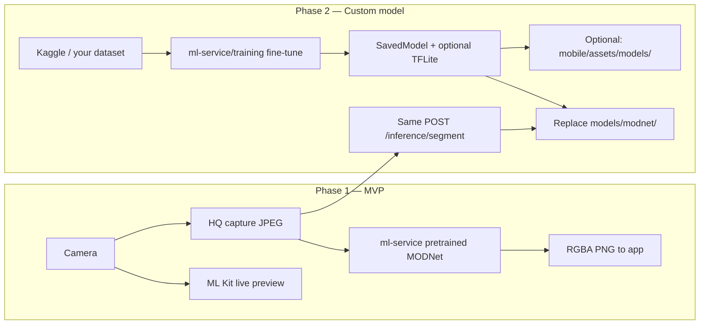

# MACKHAN — Phase 2 Plan (Custom Model Training)

> **When to use this doc:** After **Phase 1 (MVP)** is complete — all items in [PLAN.md](PLAN.md) §0–§13 and [TASKS.md](TASKS.md) checked off.  
> **Phase 1:** Pretrained models only (ML Kit live, MODNet HQ server).  
> **Phase 2:** Fine-tune on your own data (e.g. Kaggle), export weights, swap into the existing app **without rewriting the product**.

**This file does not replace [PLAN.md](PLAN.md).** Agents building MVP must still follow PLAN.md only. Phase 2 work starts only when this plan is explicitly adopted (update PLAN.md §14 or promote sections into PLAN.md).

---

## 0. Summary

| Question | Answer |
|----------|--------|
| Can we train on Kaggle data later? | **Yes** — offline training, not in the app UI |
| Do we train during MVP? | **No** — use pretrained MODNet + ML Kit |
| What do we train? | Primarily **server HQ model** (MODNet fine-tune). Optional: **TFLite** for on-device fallback |
| What changes in the app? | **Minimal** — same API and same file paths; swap model files + optional env/version flag |
| Where does training code live? | New folder: `ml-service/training/` (not built in Phase 1) |

---

## 1. Phase 1 vs Phase 2



| Layer | Phase 1 | Phase 2 change |
|-------|---------|----------------|
| Live preview (`mobile/`) | Google ML Kit | **Usually unchanged** (optional TFLite swap) |
| HQ capture (`ml-service/`) | Pretrained MODNet | **Fine-tuned MODNet** (same input/output contract) |
| Backend (`backend/`) | Auth, profile | **No change** |
| API contract | `POST /inference/segment` → PNG | **Same** |

---

## 2. Prerequisites (before Phase 2)

Complete Phase 1 first:

- [ ] Flutter app runs on Android (Tasks 12–16)
- [ ] Backend + Firebase working
- [ ] `ml-service/` runs with pretrained MODNet (or placeholder replaced with real weights)
- [ ] Baseline benchmark recorded: `POST /inference/benchmark` (avg ms, FPS, p95)
- [ ] Baseline quality reviewed on 20+ real portraits (your target users)

**Hardware for training (recommended):**

| Setup | Use |
|-------|-----|
| Google Colab (free GPU) | Fine-tune experiments |
| Local PC + NVIDIA GPU | Repeatable training |
| CPU only | Possible but slow — not recommended for MODNet |

**Software:** Python **3.11**, TensorFlow **≥2.15**, same stack as `ml-service/requirements.txt`.

---

## 3. Dataset strategy (Kaggle and alternatives)

### 3.1 What the model needs

Portrait **matting** = for each image, an **alpha mask** (who is foreground vs background).

| Required | Format |
|----------|--------|
| RGB image | `.jpg` / `.png` |
| Alpha or trimap mask | Same resolution (or resize in loader) |

### 3.2 Kaggle datasets (examples — verify license before use)

| Dataset type | Good for | Notes |
|--------------|----------|-------|
| Portrait matting (alpha masks) | **Best** — direct MODNet fine-tune | Search: "portrait matting", "human matting", "alpha matte" |
| Person segmentation (binary mask) | OK with conversion | Convert mask → soft alpha |
| COCO / generic segmentation | Weaker for portraits | More background clutter |

**Always check:** license (commercial use?), attribution, train/val split, diversity (skin tone, hair, lighting).

### 3.3 PLAN.md suggested sources (non-Kaggle)

- [Supervisely Person Dataset](https://supervise.ly/)
- AISegment portrait data  
(Same pipeline as Kaggle — images + masks in a folder structure.)

### 3.4 Recommended folder layout (training)

```
ml-service/training/data/
├── train/
│   ├── images/
│   │   ├── 0001.jpg
│   │   └── ...
│   └── masks/
│       ├── 0001.png    # single-channel alpha 0–255
│       └── ...
└── val/
    ├── images/
    └── masks/
```

**Split:** 80% train / 20% val (stratified by scene type if possible).  
**Do not commit raw data to git** — add `ml-service/training/data/` to `.gitignore`.

---

## 4. Training approach

### 4.1 Recommended: fine-tune MODNet (not train from scratch)

1. Start from **official MODNet pretrained weights** (same family as Phase 1).
2. Fine-tune on your `train/` set with small learning rate (e.g. `1e-4` → `1e-5`).
3. Validate on `val/` with:
   - **MAD** / **MSE** on alpha
   - **SAD** (sum of absolute differences)
   - Visual inspection (hair edges, glasses, dark skin)
4. Early-stop when val loss plateaus.
5. Export **TensorFlow SavedModel** to `ml-service/models/modnet/` (replace Phase 1 weights).

**Why fine-tune:** Faster, less data, fits existing `inference/engine.py` with **zero API changes** if output shape stays `[1, H, W, 1]` alpha.

### 4.2 Optional: train / export mobile TFLite

Only if you need **better on-device fallback** than ML Kit:

1. Fine-tune a lighter arch (MobileNet-based segmenter) or export quantized MODNet.
2. Convert to `.tflite` → `mobile/assets/models/selfie_segmentation.tflite`.
3. Update `MlOnDeviceService.segmentTflite()` input size / normalization to match export.

**Live preview default stays ML Kit** unless you deliberately switch primary path in `ml_on_device_service.dart`.

### 4.3 What NOT to build (per PLAN.md §14)

- Custom model training UI inside the app  
- In-app dataset upload for training  
- Automatic Kaggle download from production servers  

Training is **developer-only scripts** on a workstation or Colab.

---

## 5. New code to add (Phase 2 only)

| Path | Purpose |
|------|---------|
| `ml-service/training/README.md` | How to prepare data + run train |
| `ml-service/training/dataset.py` | Load image/mask pairs, augmentations |
| `ml-service/training/train_modnet.py` | Fine-tune loop, checkpointing |
| `ml-service/training/export_savedmodel.py` | Write `models/modnet/` |
| `ml-service/training/export_tflite.py` | Optional mobile export |
| `ml-service/training/eval.py` | Val metrics + side-by-side PNGs |
| `ml-service/training/requirements-train.txt` | Extra deps (e.g. `matplotlib`, `tqdm`) — only if needed |

**Ponytail rule:** Reuse `preprocessing/frame.py` normalization constants where possible so train and serve stay aligned.

---

## 6. Code that changes when you swap the trained model

### 6.1 Server — usually **no logic changes**

These files should work **as-is** if the new SavedModel keeps the same signature:

| File | Role |
|------|------|
| `ml-service/inference/engine.py` | Loads SavedModel from `MODEL_PATH` |
| `ml-service/inference/segment.py` | Orchestrates preprocess → predict → postprocess |
| `ml-service/preprocessing/frame.py` | 512×512 letterbox + normalize |
| `ml-service/postprocessing/mask.py` | Resize alpha, composite PNG |
| `ml-service/api/routes.py` | `POST /inference/segment`, `/inference/benchmark` |
| `ml-service/config.py` | `model_path`, `model_type` |

**Only change if your export differs:**

| Change needed | File to touch |
|---------------|---------------|
| Different input size (not 512) | `preprocessing/frame.py`, re-export with fixed size |
| Different output tensor name/shape | `inference/engine.py` `predict()` parsing |
| New model family (not MODNet) | `engine.py`, possibly `preprocessing/`, `postprocessing/` |

### 6.2 Config / deploy

| File | Change |
|------|--------|
| `ml-service/.env` | `MODEL_PATH=./models/modnet` (or `./models/modnet_v2`) |
| `ml-service/.env` | Optional: `MODEL_TYPE=modnet-finetuned` (cosmetic for `/health`) |
| `ml-service/models/modnet/` | **Replace** SavedModel directory |
| `ml-service/Dockerfile` | Copy new weights into image (or volume mount) |
| `docker-compose.yml` | Volume `./ml-service/models:/app/models` already supports swap |

### 6.3 Mobile app — minimal

| File | Phase 2 change |
|------|----------------|
| `mobile/lib/data/repositories/ml_repository.dart` | **No change** — still POST multipart to ML service |
| `mobile/lib/core/constants/api_constants.dart` | **No change** unless ML service URL changes |
| `mobile/lib/services/ml_on_device_service.dart` | **Only if** you ship new TFLite fallback |
| `mobile/assets/models/selfie_segmentation.tflite` | Replace file if TFLite export done |
| `mobile/pubspec.yaml` | Asset entry unchanged if same filename |

**HQ capture flow (PLAN §8.6) stays identical** — app sends JPEG, receives PNG.

### 6.4 Backend

**No changes** — JWT and profile APIs are unrelated to model weights.

---

## 7. Step-by-step: train → deploy → verify

### Step A — Prepare data

1. Download Kaggle dataset (CLI or web).
2. Script: resize masks, ensure pairing `images/xxx` ↔ `masks/xxx`.
3. Split train/val → `ml-service/training/data/`.

### Step B — Train (example commands)

```bash
cd ml-service
python -m venv .venv && source .venv/bin/activate   # Windows: .venv\Scripts\activate
pip install -r requirements.txt -r training/requirements-train.txt

# Place official MODNet checkpoint in training/checkpoints/pretrained/

python training/train_modnet.py \
  --data training/data \
  --pretrained training/checkpoints/pretrained \
  --epochs 20 \
  --batch-size 8 \
  --out training/runs/run_001

python training/export_savedmodel.py \
  --checkpoint training/runs/run_001/best \
  --out models/modnet
```

### Step C — Local smoke test

```bash
python scripts/download_model.py   # should see "Model present"
pytest tests/test_inference.py -q
curl -X POST http://localhost:8000/inference/benchmark -H "Content-Type: application/json" -d "{\"iterations\": 10}"
```

Compare FPS and visual quality vs Phase 1 baseline.

### Step D — Deploy

1. Copy `models/modnet/` to server or rebuild Docker image.
2. Restart `ml-service` (`uvicorn` or container).
3. `GET /health` → `model_loaded: true`, `model_type` reflects new tag if set.
4. Test from Android app: HQ capture on same test photos.

### Step E — Rollback

Keep previous weights as `models/modnet_pretrained/`; set `MODEL_PATH` back in `.env` if fine-tune regresses.

---

## 8. Quality gates (accept / reject fine-tuned model)

| Gate | Target |
|------|--------|
| Server FPS | ≥ 2 FPS on target CPU (PLAN §7.7) |
| HQ latency | < 500ms avg on 1080p input (PLAN §9) |
| Edge quality | Hair, glasses, shoulders — manual review |
| Failure rate | No increase in 500 errors vs baseline |
| App flow | No mobile code change required for server-only swap |

If fine-tuned model is slower, consider quantization or smaller input size before shipping.

---

## 9. Phase 2 tasks

Full step-by-step prompts: **[TASKS2.md](TASKS2.md)** (Tasks 21–31, optional 29a–29b).

| # | Task | Delivers |
|---|------|----------|
| 21 | Phase 2 gate + baseline | Benchmark + sample captures for A/B |
| 22 | Training scaffold | `ml-service/training/` + gitignore |
| 23 | Dataset prep script | Kaggle → train/val layout |
| 24 | `dataset.py` | Loader + augmentations |
| 25 | `train_modnet.py` | Fine-tuned checkpoint |
| 26 | `export_savedmodel.py` | `models/modnet/` |
| 27 | `eval.py` | Metrics vs baseline |
| 28 | Model swap + benchmark | Deploy + rollback path |
| 29 | Android HQ validation | End-to-end without app rewrite |
| 29a–b | (Optional) TFLite | Mobile fallback |
| 30–31 | Docs + sign-off | INSTALLATION Phase 2 section |

---

## 10. Risks

| Risk | Mitigation |
|------|------------|
| Bad Kaggle license | Read license; keep provenance doc |
| Overfit small dataset | Augmentations, early stop, diverse val set |
| Train/serve preprocessing mismatch | Share normalize constants with `preprocessing/frame.py` |
| TensorFlow version drift | Pin TF in training and Docker same as `requirements.txt` |
| Worse than pretrained | A/B test; keep rollback weights |

---

## 11. References

- Phase 1 blueprint: [PLAN.md](PLAN.md) §7 (ML service), §8.5–8.6 (camera + HQ capture)
- MODNet: https://github.com/ZHKKKe/MODNet
- Current loader: `ml-service/inference/engine.py`
- Current train stub note: PLAN.md §7.2 optional `ml-service/training/`

---

*Created: 2026-07-13 — Phase 2 planning document. Do not implement until Phase 1 MVP is complete.*
